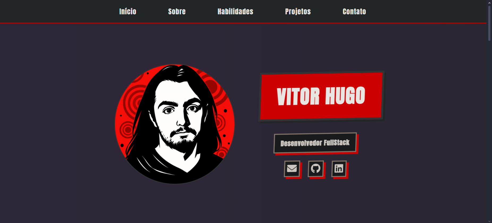

# Portfólio pessoal



Um site de portfólio pessoal criado para apresentar minha jornada como desenvolvedor, destacando conhecimentos técnicos, projetos realizados e experiência profissional.

## 🚀 Acesso ao Site

O portfólio está disponível em: [https://vitorhugo-tech.github.io](https://vitorhugo-tech.github.io)

## 💻 Tecnologias e Recursos Implementados

-**HTML** - Para estruturar a página
-**CSS** - Para estilizar os elementos da página
-**Javascript** - Para adicionar algumas funcionalidades básicas ao portfólio

## 🛠️ Instalação Local

Para visualizar o projeto em sua máquina:

1. Clone este repositório:
```bash
git clone https://github.com/vitorhugo-tech/vitorhugo-tech.github.io.git .
```

2. Abra o HTML no seu navegador:
```bash
open index.html
```

## 📂 Organização do Código

O projeto está estruturado de forma modular:

```
├── index.html          # Página única do portfólio
├── script.js           # Funcionalidades interativas
├── styles/             # Estilos separados por seção
└── images/             # Imagens que são utilizadas no projeto
```
